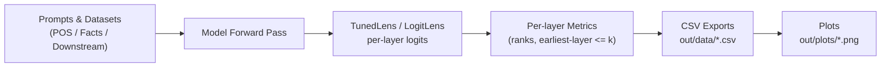

# How Do LLMs Use Their Depth? — Code & Figures

Lightweight code to reproduce analyses/plots for our paper on layer-wise prediction dynamics in LLMs (POS, multi-token facts, and option-constrained tasks). The workflow: trace per-layer logits → write CSVs → make figures.

---

## System Figure

## **Environment Setup**

