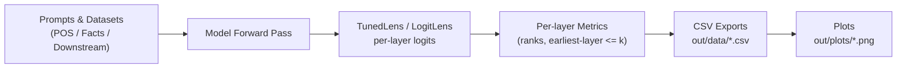

# How Do LLMs Use Their Depth? — Code for Reproducing Results

Lightweight code to reproduce analyses/plots for our paper on layer-wise prediction dynamics in LLMs (POS, multi-token facts, and option-constrained tasks). The workflow: trace per-layer logits → write CSVs → make figures.

---
## System Figure

## **Environment Setup**
```bash
# Conda (recommended)
conda create -n depthstudy python=3.10 -y
conda activate depthstudy
pip install -U torch transformers tuned-lens pandas numpy matplotlib seaborn tqdm
```
## **Create Output Folders**
```bash
mkdir -p out/data out/plots out/plot_data out/Layer_vs_Rank
```
## **Generate CSVs**
```bash
# POS case study → writes: out/data/gpt2-xl_{POS}_logit.csv
python analyze_knowledge_layers_pos.py

# Multi-token facts (MQuAKE) → writes: out/data/fact_gpt2-xl_REASONING_logit.csv
python analyze_knowledge_layers_facts.py

# Option-constrained downstream tasks → one CSV per task
python downstream_task_options_analysis.py
```
## **Make Plots**
```bash
# Factual "earliest layer vs rank" (reads facts CSV above)
python -u plot_facts2.py
# Output: out/plots/gpt2-xl_mquake_fact_logit.png
```


