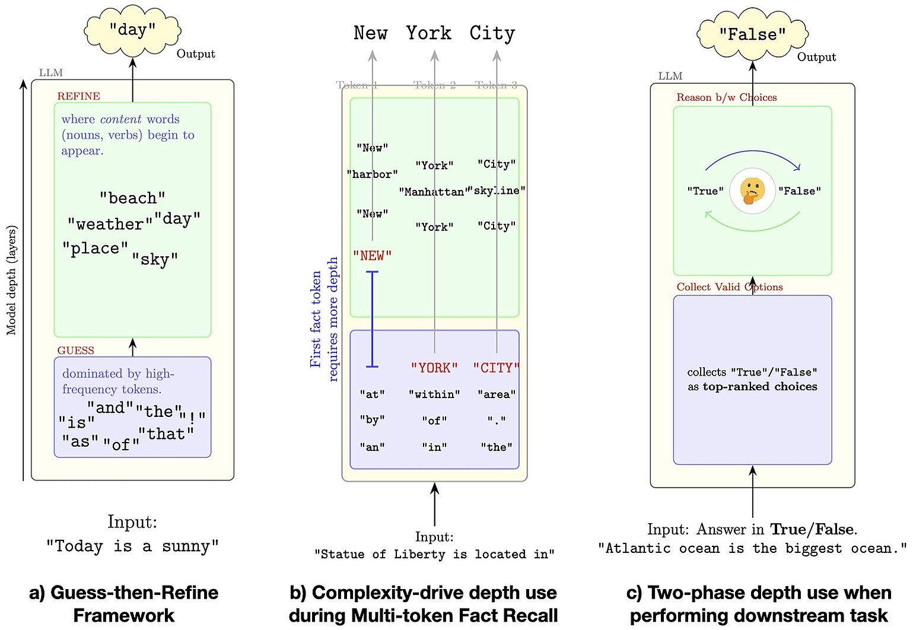
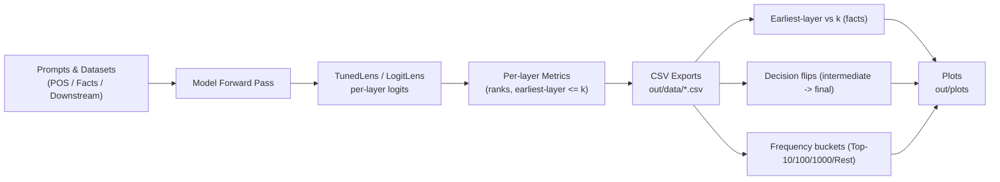

# How Do LLMs Use Their Depth? — Code to Generate Figures

Minimal instructions to reproduce the paper’s figures from code. Workflow: trace per-layer logits → write CSVs → plot (POS, multi-token facts, downstream options; plus frequency buckets and decision flips). Note: environments vary—on some clusters you may need to install extra Python packages or pin versions.

---
## Paper Results
Large language models follow a “guess-then-refine” pattern. Early layers make quick, common-token guesses; later layers use context and change about 60–80% of those early picks. Function words (the/at/of) become correct at shallow layers, while content words (nouns, verbs, adjectives) need more depth. For multi-token facts, the first token is the hardest and typically needs the most depth; later tokens appear earlier. In constrained-choice tasks, models gather a shortlist of good options early, then make the final choice near the end. Easier predictions settle sooner; harder ones resolve deeper in the network. This repo reproduces these results end-to-end: it writes per-layer CSVs, plots frequency buckets and decision flips, and produces “earliest-layer” curves for parts-of-speech and multi-token facts.

---
## Analysis & Figure Generation Pipeline

---

## Environment Setup
~~~bash
# Conda (recommended)
conda create -n depthstudy python=3.10 -y
conda activate depthstudy

# Core packages
pip install -U torch transformers tuned-lens pandas numpy matplotlib seaborn tqdm

# Plotly exports (for frequency/flip figures)
pip install -U plotly kaleido

# POS tagging (for POS case study)
pip install spacy && python -m spacy download en_core_web_sm
~~~

---

## Create Output Folders
~~~bash
mkdir -p out/data out/plots out/plot_data out/Layer_vs_Rank tokenizer_analysis
~~~

---

## Generate CSVs (run what you need)
~~~bash
# POS case study → writes: out/data/gpt2-xl_{POS}_logit.csv
python analyze_knowledge_layers_pos.py

# Multi-token facts (MQuAKE) for earliest-layer curves
# → writes: out/data/fact_gpt2-xl_REASONING_logit.csv   (adjust model/suffix in script if needed)
python analyze_knowledge_layers_facts.py

# Option-constrained downstream tasks (e.g., MMLU/SST/NLI/MRPC) → per-task CSVs
python downstream_task_options_analysis.py
~~~

---

## Make Plots
~~~bash
# Facts — "earliest layer vs rank" (uses the facts CSV above)
python -u plot_facts2.py
# Output (example): out/plots/gpt2-xl_mquake_fact_logit.png
# If your file uses a different suffix/path, edit postfix/CSV_PATH inside plot_facts2.py
~~~

~~~bash
# Frequency buckets across layers (Top-10/100/1000/Rest)
python top_ranked_token_at_each_layer.py
# Saves stacked 100% bar figures (via top_ranked_plot.py), e.g., under tokenizer_analysis/
~~~

~~~bash
# Decision flips: how often early top-1 changes by the final layer
python decision_flip_intermediate_and_final_layer_comparison.py
# Saves flip-ratio plots (also uses helpers in top_ranked_plot.py)
~~~

---

## Notebook (required)
~~~bash
# Launch Jupyter (GPU not required for plotting)
jupyter lab
# Open and run:
# - notebooks/graph.ipynb   (produces POS & general figures; includes KDE and earliest-layer views)
~~~

---

## Figure Mapping (Paper)
- **Fig. 2 — Frequency buckets early in depth:** `top_ranked_token_at_each_layer.py` (renders via `top_ranked_plot.py`).  
- **Fig. 3 — Decision flips with depth:** `decision_flip_intermediate_and_final_layer_comparison.py` (renders via `top_ranked_plot.py`).  
- **Fig. 4 — Earliest crossing thresholds (POS & Facts):**  
  - Generate CSVs with `analyze_knowledge_layers_pos.py` and `analyze_knowledge_layers_facts.py`.  
  - Plot **facts** with `plot_facts2.py`; plot **POS/general** with `notebooks/graph.ipynb`.

> Plotting can run on CPU; CSV generation is faster with a GPU.

---

## Troubleshooting
~~~bash
# CSV not found → run the matching analysis script first OR edit CSV_PATH/postfix in plot_facts2.py
ls -1 out/data/fact_gpt2-xl_REASONING_*.csv

# "Cannot save file into a non-existent directory" → create folders
mkdir -p out/plots out/plot_data out/Layer_vs_Rank tokenizer_analysis

# Plotly export errors → ensure Kaleido is installed
pip install -U kaleido
~~~

_Minimal KDE guard for graph.ipynb (avoid empty/constant-series crashes):_
~~~python
import pandas as pd
s = df.groupby("prompt index")["layer"].min().dropna()
if s.size >= 2 and s.nunique() >= 2:
    s.plot.kde(...)
~~~
---

## Citation
*How Do LLMs Use Their Depth?* — please cite if you use this code or figures.

